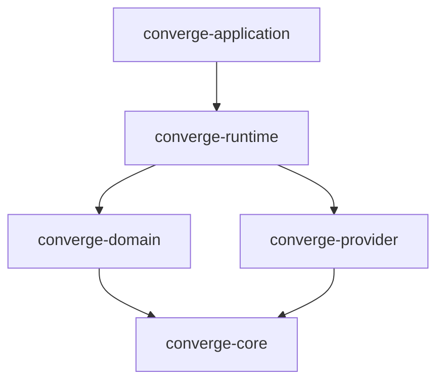

# Architecture - converge-application

`converge-application` is the **distribution layer** of the Converge ecosystem. Its primary role is composition and packaging rather than semantic definition.

## The Distribution Role

In a layered architecture, `converge-application` sits at the top. It is responsible for wiring together the specialized crates into a functional product.

### Core Philosophy

- **Composition over Logic**: This crate should contain minimal unique business logic. Its complexity lies in its configuration and composition of other crates.
- **Explicit Boundaries**: It respects the semantic authority of `converge-core` and the business meaning defined in `converge-domain`.
- **Axiom: App composes; does not invent**: `converge-application` must not define business types, business rules, or new DSLs. It composes already defined domain meaning.

## Product Taxonomy

Deliverables are organized into a strict hierarchy to ensure clarity and reusability:

- **Converge Truths**: Business-level contracts ("what must be true"). They are the source of invariants, acceptance criteria, and lifecycle semantics.
- **Pack**: A reusable unit of business truth. It's a distributable bundle of Truths, wiring metadata (YAML/JSON), and defaults.
- **Blueprint**: A curated composition of Packs and agents, defining a high-level domain pattern (e.g., Lead Qualification).
- **Flow**: The actual execution where agents propose facts, the engine validates them against Truths, and the system converges to a stable outcome.
- **App**: A deployed, tenant-specific experience built on Blueprints.

## Layered Composition

The application composes the following layers:

1. **`converge-core` (The Kernel)**: Provides the convergence engine, monotonicity guarantees, and the base `Context` model.
2. **`converge-provider` (Capabilities)**: Exposes adapters for LLMs (Anthropic, OpenAI, etc.) and vector stores.
3. **`converge-domain` (Meaning)**: Defines the business rules, Gherkin-based invariants, and domain-specific agents.
4. **`converge-runtime` (Execution)**: Provides the HTTP API, job lifecycle management, and template registry.

## System Diagram

## Component Breakdown

### CLI Gateway (`src/main.rs`)

The entry point that parses global configuration, initializes observability (tracing), and resolves environment variables (.env). It delegates to specific commands (e.g., `serve`, `run`).

### Distribution Config

Configures which domain packs are enabled by default and maps provider keys to runtime instances.

## Data Flow

1. **Request Intake**: User submits a job via CLI or HTTP (via Runtime).
2. **Template Resolution**: Application/Runtime identifies the requested template from `converge-domain`.
3. **Provider Binding**: Application wires the required LLM/Storage providers to the domain agents.
4. **Execution**: The Core engine runs the convergence loop until completion or budget exhaustion.
5. **Collection**: Results, provenance, and audit logs are returned to the caller.

## Security & Governance

As the outermost layer, `converge-application` is responsible for:

- Secret management (API keys).
- Resource quotas and budgets.
- Access control and audit log export hooks.
